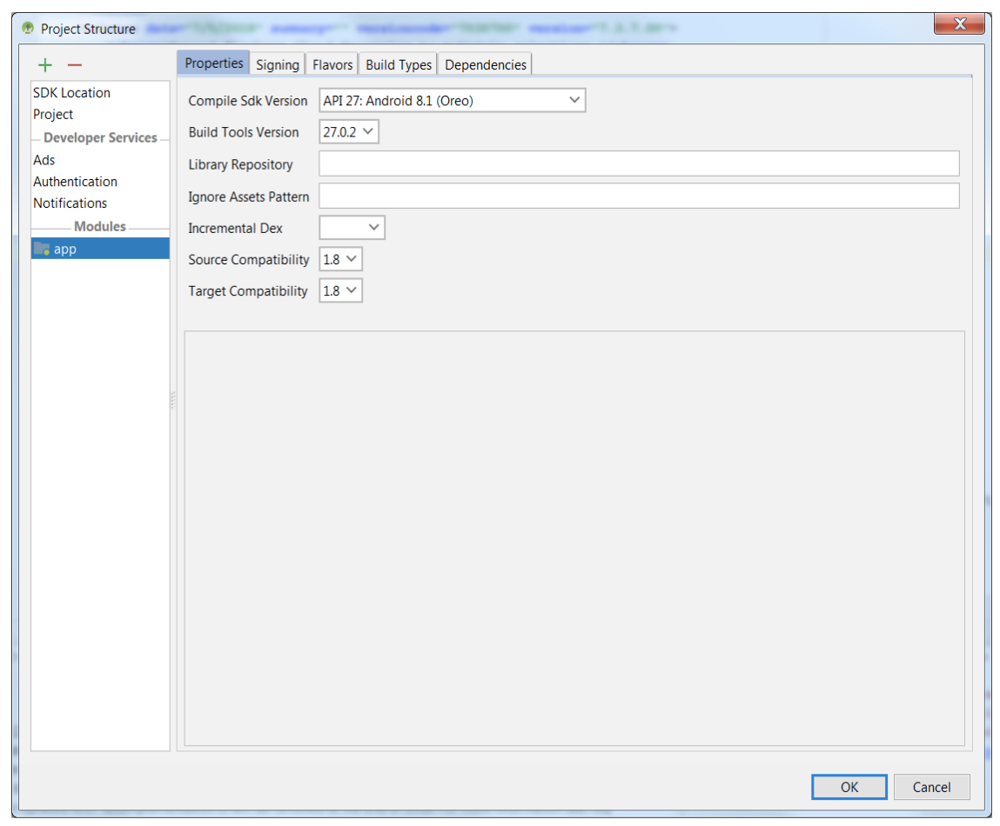
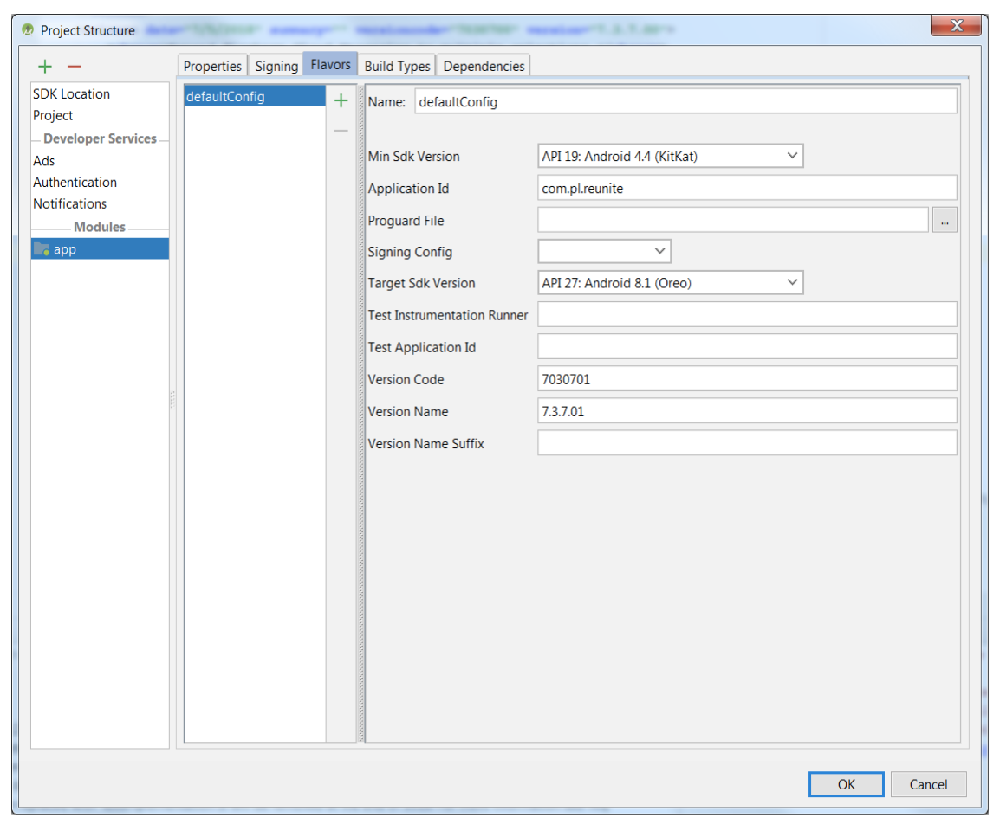

# ReUnite - Android #

The Reunite app is designed to speed uploading necessary personal information about missing (and found) people to NLM's People Locator service available (now defunct).  

The ReUnite app and People Locator web app are products of the Lost Person Finder project (now defunct) at the Lister Hill National Center for Biomedical Communications, which is an intramural R&D division of the U.S. National Library of Medicine, part of the U.S. National Institutes of Health.  

### Installation ###

- Runs on Android 5 (Lollipop) and later  
- Android Studio 3.1.4+  
- Built With: Java language, Android API, MySQL, KSOAP  
- To run this app you will need to define your own URL endpoint and a web site provide web services  

### The Top-Level Build File ###

```
apply plugin: 'com.android.application'

android {

    compileSdkVersion 27
    buildToolsVersion '27.0.2'

    defaultConfig {
        applicationId "com.pl.reunite"
        minSdkVersion 19
        targetSdkVersion 27
        versionCode 7030701
        versionName '7.3.7.01'

        multiDexEnabled true //important

        dexOptions {
            incremental true
            javaMaxHeapSize "2048M"
        }

    }
    buildTypes {
        release {
            minifyEnabled false
            proguardFiles getDefaultProguardFile('proguard-android.txt'), 'proguard-rules.pro'
        }
    }
    productFlavors {
    }
    compileOptions {
        sourceCompatibility JavaVersion.VERSION_1_8
        targetCompatibility JavaVersion.VERSION_1_8
    }
}

dependencies {
    implementation 'com.google.firebase:firebase-messaging:11.0.4'
    compile fileTree(include: ['*.jar'], dir: 'libs')
    compile files('libs/ksoap2-android-assembly-2.6.4-jar-with-dependencies.jar')
    compile 'com.facebook.android:facebook-android-sdk:4.6.0'
    compile 'com.google.android.gms:play-services:11.0.4'
    compile 'com.google.android.gms:play-services-ads:11.0.4'
    compile 'com.google.android.gms:play-services-identity:11.0.4'
    compile 'com.google.android.gms:play-services-gcm:11.0.4'
    compile 'org.apache.commons:commons-io:1.3.2'
    compile 'com.android.support.constraint:constraint-layout:1.0.0-alpha9'
    testCompile 'junit:junit:4.12'
}
apply plugin: 'com.google.gms.google-services'
```

### Project Settings ###

  

